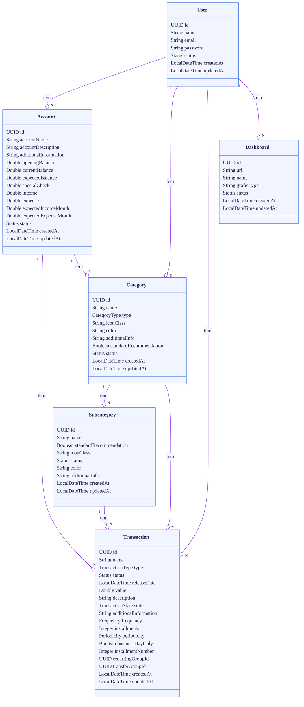

## 🖥️ Back end
# 💡 Lúmen – Gerenciador Financeiro

O **Lúmen** é uma aplicação de gerenciamento financeiro desenvolvida para facilitar o controle de receitas, despesas e planejamento financeiro pessoal.

Com o Lúmen, você pode:
- Criar contas e organizá-las por **categorias personalizadas**;
- Atribuir **ícones e cores** às categorias;
- Adicionar **receitas e despesas** de forma rápida e intuitiva;
- **Agendar lançamentos** futuros para manter suas finanças sempre em dia.

---

## 🚀 Deploy
🔗 Acesse a aplicação: [squad25.fourdevs.com.br](https://squad25.fourdevs.com.br) 

## 🖥️ Front end
🔗 Acesse o repositório: [Acessar](https://github.com/wilkenio/squad25_frontend.git)

## 📄 Swagger
🔗 Acesse o swagger: [acessar](https://apisquad25.fourdevs.com.br/swagger-ui/index.html#/)

---

## 🧠 Equipe Lúmen

| Função         | Nome               | GitHub                                   |
|----------------|--------------------|-------------------------------------------|
| 💻 Front-end   | Yuri           | [@YuriJS123](https://github.com/YuriJS123)    |
| 💻 Front-end   | Wesley           | [@wsleyvarejao87](https://github.com/wsleyvarejao87)    |
| ⚙️ Back-end    | Cleybson           | [@cleybson7](https://github.com/cleybson7)    |
| ⚙️ Back-end    | Denis           | [@dsilvand](https://github.com/dsilvand)    |
| 🧭 Gestão      | Anne         | [@Anne-Beatriz](https://github.com/Anne-Beatriz)|
| 🧭 Gestão e 🎨 Design    |  Álvaro      | [@4lvarofagundes](https://github.com/4lvarofagundes)|
| 👨‍💻 Tech Lead      | Wilkenio          | [@Wilkenio](https://github.com/wilkenio)    |

---

# API de gestão financeira

É a aplicação backend de um sistema de gestão financeira que ajuda os utilizadores a controlar e gerir eficazmente as suas despesas.

## Overview

A aplicação fornece uma API REST segura que permite aos utilizadores:
- Registar e autenticar utilizadores
- Gerir transacções financeiras
- Acompanhar as despesas e o historial financeiro

## Tecnologias

### Core
- Java 17
- Spring Boot 3.4.4
- PostgreSQL Database

### Spring Dependencies 🌱
- Spring Boot Starter Web**: Para criar a API REST
- Spring Boot Starter Security**: Para autenticação e segurança
- **Spring Boot Starter Data JPA**: Para operações de base de dados e ORM
- **Spring Boot DevTools**: Para produtividade de desenvolvimento
- **PostgreSQL Driver**: Para conetividade com a base de dados
- **Lombok**: Para reduzir o código boilerplate
- **Java JWT(Auth0)**: Para autenticação de token JWT
- **Spring Boot Starter Test**: Para testes unitários e de integração

## Como começar

### Pré requisitos
- Java 17 ou superior
- PostgreSQL instalado e em execução
- Maven instalado (ou use o wrapper Maven incluído)

### Configuração do banco de dados
1. Crie um banco de dados PostgreSQL com o nome `financeiro`
2. Atualizar a configuração do banco de dados em `application.properties` se necessário:
```properties
spring.datasource.url=jdbc:postgresql://localhost:5432/financeiro
spring.datasource.username=your_username
spring.datasource.password=your_password
```
### Rodando a aplicação

1. Clone o repositório:
```bash
git clone https://github.com/your-username/squad25_backend.git
```
2. Navegue até a pasta do projeto
   ```bash
   cd squad25_backend\api
   ```
3. Construir o projeto utilizando o wrapper Maven
   ```bash
    mvnw.cmd clean install
   ```
4. Rodar a aplicação
   ```bash
    mvnw.cmd spring-boot:run
   ```
## 🗂️ Arquitetura do Back end
<details>
<summary>⚙️ Estrutura do diretório</summary>

<pre>
<code>

📦api
 ┣ 📂src/main/java/com/financeiro/api
 ┃ ┣ 📂config
 ┃ ┃ ┗ ⚙️ SwaggerConfig.java
 ┃ ┣ 📂controller
 ┃ ┃ ┣ 🎮 AccountController.java
 ┃ ┃ ┣ 🎮 AuthController.java
 ┃ ┃ ┣ 🎮 CardController.java
 ┃ ┃ ┣ 🎮 CategoryController.java
 ┃ ┃ ┣ 🎮 DashboardController.java
 ┃ ┃ ┣ 🎮 SubcategoryController.java
 ┃ ┃ ┣ 🎮 SummariesController.java
 ┃ ┃ ┣ 🎮 TransactionController.java
 ┃ ┃ ┗ 🎮 UserController.java
 ┃ ┣ 📂domain
 ┃ ┃ ┣ 📂enums
 ┃ ┃ ┃ ┣ 🔄 CategoryType.java
 ┃ ┃ ┃ ┣ 🔄 Frequency.java
 ┃ ┃ ┃ ┣ 🔄 Periodicity.java
 ┃ ┃ ┃ ┣ 🔄 Status.java
 ┃ ┃ ┃ ┣ 🔄 TransactionState.java
 ┃ ┃ ┃ ┗ 🔄 TransactionType.java
 ┃ ┃ ┣ 🗃️ Account.java
 ┃ ┃ ┣ 🗃️ Card.java
 ┃ ┃ ┣ 🗃️ Category.java
 ┃ ┃ ┣ 🗃️ Dashboard.java
 ┃ ┃ ┣ 🗃️ Subcategory.java
 ┃ ┃ ┣ 🗃️ Transaction.java
 ┃ ┃ ┗ 🗃️ User.java
 ┃ ┣ 📂dto
 ┃ ┃ ┣ 📂accountDTO
 ┃ ┃ ┃ ┣ 📄 AccountCalculationRequestDTO.java
 ┃ ┃ ┃ ┣ 📄 AccountCalculationResponseDTO.java
 ┃ ┃ ┃ ┣ 📄 AccountRangeValueDTO.java
 ┃ ┃ ┃ ┣ 📄 AccountSummaryDTO.java
 ┃ ┃ ┃ ┣ 📄 AccountTransactionRequestDTO.java
 ┃ ┃ ┃ ┗ 📄 AccountTransactionResponseDTO.java
 ┃ ┃ ┣ 📂authDTO
 ┃ ┃ ┃ ┣ 📄 ApiResponse.java
 ┃ ┃ ┃ ┣ 📄 LoginRequestDTO.java
 ┃ ┃ ┃ ┣ 📄 RegisterRequestDTO.java
 ┃ ┃ ┃ ┗ 📄 ResponseDTO.java
 ┃ ┃ ┣ 📂cardDTO
 ┃ ┃ ┃ ┣ 📄 CardRequestDTO.java
 ┃ ┃ ┃ ┗ 📄 CardResponseDTO.java
 ┃ ┃ ┣ 📂categoryDTO
 ┃ ┃ ┃ ┣ 📄 CategoryListDTO.java
 ┃ ┃ ┃ ┣ 📄 CategoryRequestDTO.java
 ┃ ┃ ┃ ┣ 📄 CategoryResponseByIdDTO.java
 ┃ ┃ ┃ ┗ 📄 CategoryResponseDTO.java
 ┃ ┃ ┣ 📂dashboardDTO
 ┃ ┃ ┃ ┣ 📄 DashboardItemDTO.java
 ┃ ┃ ┃ ┣ 📄 DashboardRequestDTO.java
 ┃ ┃ ┃ ┗ 📄 DashboardResponseDTO.java
 ┃ ┃ ┣ 📂subcategoryDTO
 ┃ ┃ ┃ ┣ 📄 SubcategoryRequestDTO.java
 ┃ ┃ ┃ ┣ 📄 SubcategoryResponseDTO.java
 ┃ ┃ ┃ ┗ 📄 SubcategoryWithTransactionDTO.java
 ┃ ┃ ┣ 📂transactionDTO
 ┃ ┃ ┃ ┣ 📄 TransactionAdvancedFilterDTO.java
 ┃ ┃ ┃ ┣ 📄 TransactionFilterDTO.java
 ┃ ┃ ┃ ┣ 📄 TransactionRequestDTO.java
 ┃ ┃ ┃ ┗ 📄 TransactionResponseDTO.java
 ┃ ┃ ┗ 📂userDTO
 ┃ ┃   ┣ 📄 UserRequestDTO.java
 ┃ ┃   ┗ 📄 UserResponseDTO.java
 ┃ ┣ 📂infra
 ┃ ┃ ┣ 📂cors
 ┃ ┃ ┃ ┗ 🛡️ CorsConfig.java
 ┃ ┃ ┣ 📂exceptions
 ┃ ┃ ┃ ┣ ⚠️ GlobalExceptionHandler.java
 ┃ ┃ ┃ ┣ ⚠️ InvalidCredentialsException.java
 ┃ ┃ ┃ ┗ ⚠️ UserNotFoundException.java
 ┃ ┃ ┗ 📂security
 ┃ ┃   ┣ 🔒 SecurityConfig.java
 ┃ ┃   ┣ 🔒 SecurityFilter.java
 ┃ ┃   ┗ 🔒 TokenService.java
 ┃ ┣ 📂repository
 ┃ ┃ ┣ 💾 AccountRepository.java
 ┃ ┃ ┣ 💾 CardRepository.java
 ┃ ┃ ┣ 💾 CategoryRepository.java
 ┃ ┃ ┣ 💾 DashboardRepository.java
 ┃ ┃ ┣ 💾 SubcategoryRepository.java
 ┃ ┃ ┣ 💾 TransactionRepository.java
 ┃ ┃ ┗ 💾 UserRepository.java
 ┃ ┗ 📂service
 ┃   ┣ 📂impl
 ┃   ┃ ┣ ⚡ AccountServiceImpl.java
 ┃   ┃ ┣ ⚡ CardServiceImpl.java
 ┃   ┃ ┣ ⚡ CategoryServiceImpl.java
 ┃   ┃ ┣ ⚡ DashboardServiceImpl.java
 ┃   ┃ ┣ ⚡ SubcategoryServiceImpl.java
 ┃   ┃ ┣ ⚡ TransactionServiceImpl.java
 ┃   ┃ ┗ ⚡ UserServiceImpl.java
 ┃   ┣ 📂parser
 ┃   ┃ ┣ 📊 BancoDoBrasilCsvParser.java
 ┃   ┃ ┣ 📊 BancoInterCsvParser.java
 ┃   ┃ ┣ 📊 BradescoCsvParser.java
 ┃   ┃ ┗ 📊 PagBankCsvParser.java
 ┃   ┣ 🔧 AccountService.java
 ┃   ┣ 🔧 CardService.java
 ┃   ┣ 🔧 CategoryService.java
 ┃   ┣ 🔧 DashboardService.java
 ┃   ┣ 🔧 SubcategoryService.java
 ┃   ┗ 🔧 UserService.java
</code>
</pre>
</details>

## 📊 Diagrama de Classes


